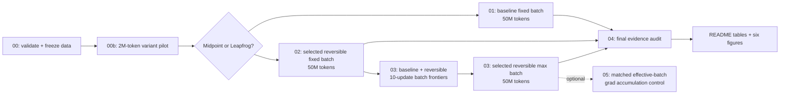

# ERA V5 — Session 13: Reversible LLM Training Lab

> **20.000768M parameters · 50M tokens per required run · Midpoint vs Leapfrog pre-selection · fixed-batch + measured max-batch evidence**

This repository is a controlled systems experiment for **ERA V5 Session 13 — Distributed Training II: Model and Pipeline Parallelism**. It asks:

> **Can reversible transformer dynamics exchange backward recomputation for enough activation-memory savings to materially increase trainable batch size, while preserving useful language-model quality?**

No benchmark number is typed into the report by hand. The notebooks emit raw JSON/CSV evidence; notebook 04 regenerates this README's result sections and figures from those files.

---

## Start here — clean Colab path

The canonical one-click notebook is:

[](https://colab.research.google.com/github/JoeIndyGit/era-v5-session-13-reversible-llm-lab/blob/main/notebooks/06_one_click_colab_submission.ipynb)

It now **clones or refreshes this repository automatically**, so it works from a blank Colab GPU runtime. For the full execution and evidence-preservation procedure, see [COLAB_RUNBOOK.md](COLAB_RUNBOOK.md).

After the final evidence audit passes, `scripts/package_evidence.py` creates a compact `submission_evidence/era-v5-session-13-evidence.zip` plus a SHA-256 manifest. The large TinyStories caches are deliberately excluded.

---

## Assignment → evidence map

| Requirement | Evidence |
|---|---|
| ~20M LLM | exact **20,000,768** parameter assertion |
| 50M-token standard run | `01_baseline_50m.ipynb` |
| Reversibility + report variant | `00b_variant_selection.ipynb` → Midpoint vs Leapfrog evidence |
| Same-batch reversible 50M run | `02_reversible_fixed_batch_50m.ipynb` |
| Reversible maximum-batch 50M run | `03_reversible_max_batch_50m.ipynb` |
| Final loss | final 100-step mean + held-out validation loss + perplexity |
| Speed | mean/median train tokens/s, excluding eval and warmup |
| Peak memory | peak allocated + peak reserved CUDA GiB |
| Other findings | batch uplift, memory saving, recomputation tax, quality delta, reconstruction error |
| Detailed README + notebooks | this README + core/optional notebooks |

---

## Experiment protocol



The variant decision happens **before** the required reversible runs, and the final audit happens **before** the README is populated.

---

## Experiment at a glance

After notebook 04:


If this image is not yet present, the required GPU runs have not been completed and the repository is **experiment-ready, not submission-complete**.

---

## Model: 20.000768M parameters, deliberately depth-heavy

A 10K TinyStories ByteLevel BPE prevents the vocabulary embedding from consuming the experiment's parameter budget.

| Component | Configuration |
|---|---:|
| Architecture | decoder-only causal Transformer |
| Vocabulary | **10,000** |
| Context | 256 |
| Layers | **22** |
| Hidden | 256 |
| Heads | 8 |
| MLP | 1,024 |
| Dropout | **0.0** |
| Weight tying | token embedding ↔ LM head |
| Parameters | **20,000,768** |
| Parameters in transformer blocks | **86.87%** |

Dropout is intentionally zero because reversible reconstruction must reproduce the same update function deterministically.

---

## Reversible variants are selected before the 50M runs

The source paper studies multiple reversible dynamics, including **Midpoint** and **Leapfrog**. This repository implements memory-efficient custom backward passes for both.

### Explicit Midpoint

[
p_{ell+1}=p_{ell-1}+2h f_{	heta_ell}(p_ell)
]

### Leapfrog

[
p_{ell+1}=2p_ell-p_{ell-1}+h^2 f_{	heta_ell}(p_ell)
]

Both use the same Euler bootstrap for the first state:

[
p_1=p_0+h f_{	heta_0}(p_0),qquad h=0.25
]

Notebook **00b** runs a 2M-token controlled pilot for both variants with identical initialization seed, data stream, batch and optimizer settings. Among candidates that remain finite and pass the reconstruction threshold, the one with the lowest held-out validation loss is selected; throughput is the tie-breaker. That decision is persisted **before** any required reversible 50M run.

<!-- VARIANT_TABLE_START -->
> Variant-selection evidence will appear after notebook 00b.
<!-- VARIANT_TABLE_END -->

Source: Gal et al., *Reversing Large Language Models for Efficient Training and Fine-Tuning*, arXiv:2512.02056.

---

## Correctness gates

```bash
python scripts/validate.py
```

The suite verifies:

- exact parameter count and depth-heavy allocation;
- identical baseline / Midpoint / Leapfrog initial parameter tensors;
- custom Midpoint backward vs naive autograd;
- custom Leapfrog backward vs naive autograd;
- forward→reverse reconstruction for both reversible variants;
- exact final partial-batch token accounting;
- token-based cosine LR endpoints.

---

## Data provenance

`00_setup_and_validation.ipynb` streams TinyStories, trains a **10K ByteLevel BPE on 100,000 stories**, and writes a 52M-token train cache plus 1M-token validation cache. `dataset_meta.json` records SHA-256 hashes of the tokenizer and both caches.

It also runs `scripts/capture_environment.py`, preserving UTC timestamp, Python/platform, Git commit, complete `nvidia-smi` output, and `pip freeze`.

Notebook 04 runs `scripts/audit_results.py` and **refuses to finalize the report** if GPU type, CUDA/PyTorch version, precision, dataset hashes, token budgets, pre-selected variant, or measured max-batch handoff are inconsistent.

<!-- HARDWARE_TABLE_START -->
> Hardware provenance will appear after all three required runs.
<!-- HARDWARE_TABLE_END -->

---

## Three required 50M-token experiments

### A — Standard residual, fixed batch

Batch 16, sequence 256, exactly 50,000,000 valid target tokens.

### B — Selected reversible variant, same fixed batch

Same model tensors, batch, data stream seed, optimizer, LR-by-token schedule, precision and token budget. This comparison isolates the **memory saving and recomputation tax**.

### C — Selected reversible variant, maximum memory-feasible batch

Notebook 03 first measures **both baseline and reversible batch frontiers**. A candidate batch must survive **10 complete forward/backward/AdamW updates** while remaining below the allocator safety threshold. Search doubles until a failure/boundary, then binary-searches to the largest passing integer batch. The full reversible run uses that measured batch.

<!-- BATCH_TABLE_START -->
> Batch-frontier table will appear after notebook 03 measures both baseline and reversible capacity.
<!-- BATCH_TABLE_END -->

---

# Measured results

<!-- RESULTS_TABLE_START -->
> Results are intentionally not pre-filled. Run the required notebooks, then notebook 04 to populate this table from measured JSON artifacts.
<!-- RESULTS_TABLE_END -->

### Key measured findings

<!-- FINDINGS_START -->
Measured findings will be generated after all three 50M-token runs complete.
<!-- FINDINGS_END -->

### Evidence figures

Notebook 04 generates:

- `assets/executive_summary.png`
- `assets/loss_vs_tokens.png`
- `assets/memory_comparison.png`
- `assets/throughput_comparison.png`
- `assets/quality_memory_frontier.png`
- `assets/batch_capacity_frontier.png`

---

## Qualitative LM sanity check

<!-- QUALITATIVE_TABLE_START -->
> Deterministic generation samples will appear after the two fixed-batch runs.
<!-- QUALITATIVE_TABLE_END -->

---

## Optional research control: matched effective batch

`05_optional_matched_effective_batch_control.ipynb` runs a fourth, clearly labelled control. It keeps the **standard model** within its physical-memory limit and uses exact token-weighted gradient accumulation until its effective batch equals the reversible maximum batch.

---

## One-command GPU execution

For the final graded run, `notebooks/06_one_click_colab_submission.ipynb` calls `scripts/run_full_submission.py`, which executes the complete required pipeline on one CUDA GPU, skips already-completed authoritative artifacts after a restart, runs the final evidence audit, and renders the README/figures from measured files only. It deliberately refuses CPU-only benchmark execution.

### Required execution order

```text
00 → 00b → 01 → 02 → 03 → 04
```

Or use notebook **06** as the one-click wrapper.

---

## Integrity rules

1. Do not type benchmark values into README manually.
2. Do not call a cap-limited batch search a measured maximum.
3. Do not compare throughput from different GPU types as if hardware were controlled.
4. Preserve raw JSON/CSV, batch probes, variant pilot, environment snapshot and generated figures.
5. A final repository with placeholder results is **not submission-complete**.

---

## References

- Gal, E. et al. **Reversing Large Language Models for Efficient Training and Fine-Tuning.** arXiv:2512.02056, 2025.
- Eldan, R. & Li, Y. **TinyStories: How Small Can Language Models Be and Still Speak Coherent English?** arXiv:2305.07759, 2023.

---

## Final thesis

[
oxed{	ext{memory saved} ;leftrightarrow; 	ext{recompute cost} ;leftrightarrow; 	ext{batch capacity} ;leftrightarrow; 	ext{LM quality}}
]

The conclusion is generated from measured evidence—not decided in advance.

Canonical repository: **https://github.com/JoeIndyGit/era-v5-session-13-reversible-llm-lab**
